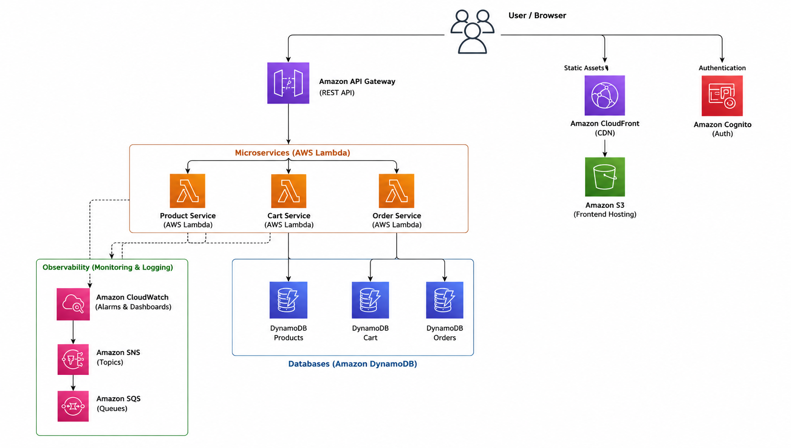

# 🛒 Serverless E-Commerce Platform on AWS

A highly-scalable, cloud-native e-commerce application built using AWS serverless services, Terraform Infrastructure as Code (IaC), Node.js microservices, and a fast, modern frontend architecture.

This project demonstrates advanced cloud engineering practices, including serverless computing, Event-Driven Architecture, secure Authentication, Dynamic Rules Engines, and automated AWS resource provisioning.

---

## 🌐 Live Deployment

| Service     | URL                                                         |
| ----------- | ----------------------------------------------------------- |
| Frontend    | https://dx4o02gcthxe4.cloudfront.net                        |
| API Gateway | https://n8jfqgmey7.execute-api.ap-southeast-1.amazonaws.com |

The frontend is hosted on **Amazon S3** and delivered globally through **Amazon CloudFront**. Backend APIs are exposed through **Amazon API Gateway** and powered by scalable **AWS Lambda** microservices.

---

## 🚀 Key Features

### 🛍️ Customer Experience
* **Dynamic Promo Rules Engine:** A smart cart that analyzes spend and dynamically surfaces discount codes (e.g., *Spend > ₹10,000 for 20% off*), complete with secure server-side validation.
* **Authentication & Authorization:** Secure login backed by **Amazon Cognito**.
* **Seamless Checkout:** Instant cart calculations with quick-checkout functionality.
* **Product Catalog:** Real-time product browsing with dynamic inventory syncing.
* **Order History:** Detailed historical tracking of previous orders and applied discounts.

### 🛡️ Admin Dashboard
* **Role-Based Access Control (RBAC):** Dedicated Admin views explicitly secured via Cognito Groups.
* **Inventory Management:** Full CRUD operations to add, update, or delete products.
* **Live Analytics:** Real-time visualization of Total Products and Total Revenue aggregated across the platform.

### ☁️ Cloud & DevOps Features
* **100% Serverless Architecture:** Zero servers to manage, infinitely scalable.
* **Infrastructure as Code:** Fully managed and reproducible environments via **Terraform**.
* **Monitoring & Alerts:** Custom **CloudWatch Dashboards** and Alarms for Lambda durations, API 5xx errors, and throttling.
* **Event-Driven Messaging:** Integration with **Amazon SNS** and **SQS** for asynchronous alerts and decoupling.

---

## 🏗️ Architecture



*A visual representation of the Serverless E-Commerce platform architecture.*

---

## ☁️ AWS Services Used

| Service            | Purpose                                    |
| ------------------ | ------------------------------------------ |
| **AWS Lambda**         | Serverless backend microservices           |
| **Amazon API Gateway** | REST API management and routing            |
| **Amazon DynamoDB**    | Highly-scalable NoSQL data storage         |
| **Amazon Cognito**     | Secure user authentication & RBAC          |
| **Amazon CloudWatch**  | Logs, Metrics, Alarms, and Dashboards      |
| **Amazon SNS & SQS**   | Event-driven alerts and queueing           |
| **Amazon S3**          | Static frontend hosting                    |
| **Amazon CloudFront**  | Global content delivery network (CDN)      |
| **AWS IAM**            | Granular security and access control       |

---

## 🛠️ Technology Stack

### Frontend
* HTML5 & Vanilla CSS3 (Custom Glassmorphism Design System)
* Vanilla JavaScript (ES6+) for ultra-fast, zero-dependency rendering

### Backend
* Node.js
* Express.js wrapped in `serverless-http`

### Cloud & Infrastructure
* Terraform (IaC)

---

## 📂 Project Structure

```text
serverless-ecommerce-aws/

├── frontend/                 # S3/CloudFront static assets
│   ├── css/                  # Modular stylesheets
│   ├── js/                   # Vanilla JS logic (auth, cart, orders, ui)
│   └── index.html            # Main SPA entrypoint
│
├── infrastructure/           # Terraform IaC definitions
│   ├── main.tf               # Providers & global config
│   ├── lambda.tf             # Microservice definitions
│   ├── dynamodb.tf           # NoSQL table schemas
│   ├── api-gateway.tf        # REST API routing
│   ├── cognito.tf            # Auth pools & groups
│   ├── observability.tf      # CloudWatch, SNS, SQS
│   ├── frontend.tf           # S3 & CloudFront
│   └── variables.tf          # Environment variables
│
├── services/                 # Node.js Microservices
│   ├── product/              # Inventory & Catalog
│   ├── cart/                 # User shopping carts
│   └── order/                # Checkout & Discount Engine
│
└── README.md
```

---

## ⚙️ Deployment

This project uses **Terraform** for seamless 1-click deployments.

```bash
cd infrastructure
terraform init
terraform plan
terraform apply -auto-approve
```

Terraform automatically provisions and wires together the API Gateway, Lambda functions, DynamoDB tables, Cognito User Pools, S3 buckets, CloudFront CDN, and IAM policies.

---

## 📚 Learning Outcomes & Business Value

This architecture proves highly valuable for modern enterprises because it provides:
1. **Zero-Maintenance Scale:** Relying entirely on managed AWS services means no OS patching or server maintenance.
2. **Cost-Efficiency:** You only pay for exact compute milliseconds used (Lambda) and exact storage (DynamoDB/S3).
3. **High Security:** Frontend spoofing is prevented by calculating Cart Totals and validating Promo Codes exclusively on the backend. Authentication is entirely offloaded to industry-standard Amazon Cognito.
4. **Actionable Insights:** Live CloudWatch Dashboards monitor system health and trigger SNS alerts immediately upon API degradation.

---

## 👨‍💻 Author

**Prashaant V**

Built as a comprehensive cloud-native e-commerce platform to demonstrate expertise in AWS Serverless Architecture, Infrastructure as Code, Microservices best practices, and modern web development.
